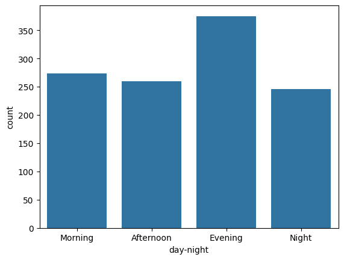
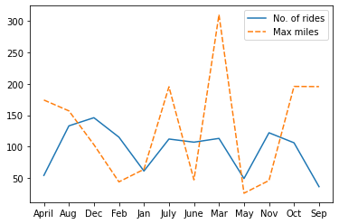
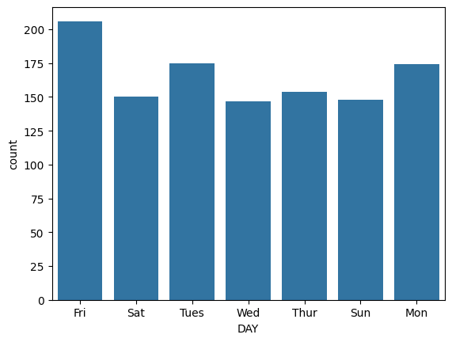
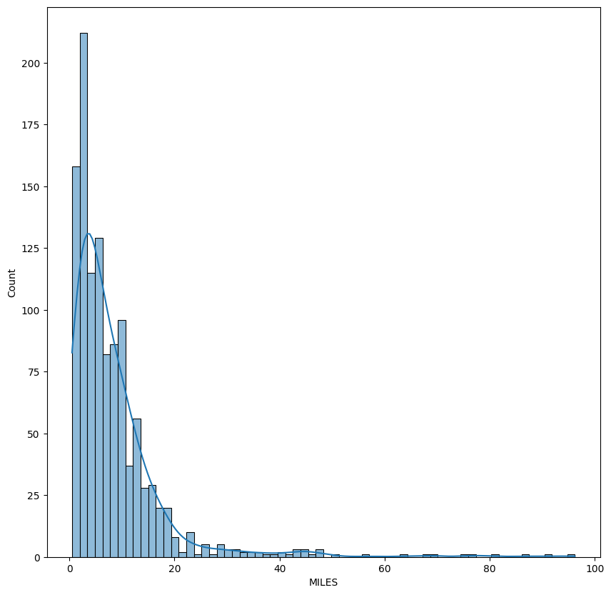

# Uber Rides Data Analysis

## Project Overview
This project analyzes Uber rides data to provide insights into customer booking behavior. The dataset contains **1156 rows and 7 columns**, with some missing values. The analysis focuses on ride categories, purposes, booking times, frequency, and travel distances.

## Dataset Description
Columns in the dataset:
- `START_DATE` – Date and time when the ride started
- `END_DATE` – Date and time when the ride ended
- `CATEGORY` – Type of ride (e.g., Business, Personal)
- `START` – Pickup location
- `STOP` – Drop location
- `MILES` – Distance of the ride in miles
- `PURPOSE` – Reason for the ride (e.g., Meeting, Meal, Not Specified)

## Data Cleaning & Preparation
1. Filled missing values in the `PURPOSE` column with `"Not Available"`.
2. Dropped rows with other null values.
3. Converted `START_DATE` and `END_DATE` to `datetime` format.
4. Created new columns for:
   - `Month`
   - `Day of Week`
   - `Hour`
5. Grouped `Hour` into time periods:
   - Morning
   - Afternoon
   - Evening
   - Night
6. Removed duplicate rows.
7. Saved the cleaned dataset for analysis.

## Data Analysis & Visualization

### 1. Most Booked Category
- **Insight:** Business rides are booked more frequently than Personal rides.  
- **Visualization:**

### 2. Purpose of Rides
- **Insight:** Most people do not specify a purpose. Among specified purposes, **Meal/Entertainment** and **Meeting** purposes are the most common.  

### 3. Peak Booking Time
- **Insight:** Rides are most frequently booked in the **Morning** and **Evening**.  
- **Visualization:**

### 4. Months with Less Frequent Bookings
- **Insight:** Fewer bookings are observed in **February, March, and July**, while highest bookings occur in **November and December**.  
- **Visualization:**

### 5. Most Popular Days
- **Insight:** Rides are booked most frequently on **Friday, Monday, and Tuesday**.  
- **Visualization:**

### 6. Ride Distances
- **Insight:** Most rides are booked for **3–13 miles**. Maximum miles traveled are noted in **March, September, April, and July**.  
- **Visualization:**

## Recommendations for Uber
1. **Focus on Business Customers:** Since business rides are more frequent, Uber can create tailored packages or loyalty programs for corporate clients.  
2. **Promote Purpose-Specific Offers:** Many users don’t specify a purpose. Uber could introduce targeted campaigns for meal, entertainment, or meeting-related rides.  
3. **Optimize Availability During Peak Hours:** Morning and evening are peak times, so deploying more cabs and surge pricing can maximize revenue.  
4. **Month-Specific Marketing:** Encourage rides in slower months (e.g., February, March, July) through discounts or promotions.  
5. **Distance-Based Offers:** Since most rides are short (3–13 miles), Uber can create promotions for medium-distance rides to boost usage.  
6. **Weekly Trends:** Special offers on Mondays and Fridays could capture high-demand days more effectively.

---

**Note:** Visualizations like bar charts, boxplots, and histograms were used to derive the above insights.